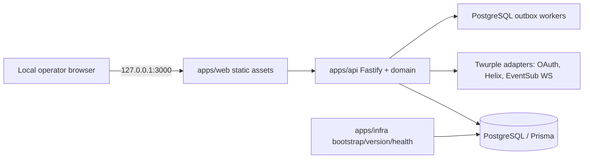

# Full-Stack Architecture: Local Twitch Queue Bot

[Português brasileiro](pt-BR/fullstack-architecture.md) · Source: [FND-0 spec](stories/FND-0/spec/spec.md), [research](stories/FND-0/spec/research.json), and [PRD](prd.md).

## Architecture constraints

One local installation, one Twitch broadcaster/client, one bot process, local PostgreSQL via Compose, no public backend/remote storage/telemetry. Product runtime is JavaScript ESM and vanilla browser assets; `.env.example` remains AIOX framework scaffolding. Code is placed under `apps/*`.

## Runtime topology

Root `Dockerfile` and `compose.yaml` are product entrypoints. Compose services: one-shot `bootstrap`; persistent healthy `db`; one-shot `migrate` after DB health; non-root `bot` only after migrations complete. Host publishes only `127.0.0.1:3000:3000`; Fastify binds `0.0.0.0` in its container. Database has no host port. Volumes persist DB and operational secrets.

## Application modules

- `apps/web`: HTML/CSS/vanilla JS operator panel; uses explicit API projections and safe text APIs.
- `apps/api`: Fastify process composition, local security, route handlers, domain services, persistence adapters, Twitch adapters, EventSub and durable workers.
- `apps/api/prisma`: Prisma 6 schema/config/client generation and PostgreSQL migrations, including SQL constraints not represented by Prisma schema.
- `apps/infra`: bootstrap secret helper, product version validation/materialization, health and operations utilities.
- `tests`: Vitest unit/contract tests and isolated real-PostgreSQL/Compose integration suites.

## Data and consistency

PostgreSQL holds queue configuration, global queue keys, entries, redemptions (including rejected ones), outbox, audit, account/settings, OAuth credentials and processed operation dedupe. IDs from Twitch and UID remain strings. PostgreSQL constraints enforce reward/message uniqueness, key namespace uniqueness, source/ID integrity, active user per queue, and stable financial/operation idempotency. Queue changes serialize in short transactions; global account changes use transactionally serialized updates. No database transaction remains open across Twitch I/O.

For terminal entry actions, one transaction changes domain state, order/account ownership, audit, policy snapshot, and outbox intent. The worker calls Twitch after commit, then records confirmation/retry/conflict/unknown. Network execution is not exactly once. Chat sending is a separate effect; privacy-sensitive text is rendered at send time from current queue settings.

## Twitch boundary

Use the streamer's own confidential client and user token. Client Credentials validates the app pair; Authorization Code uses session-bound one-use state. Twurple token refresh writes atomically. EventSub WebSocket receives channel chat and reward redemption events; Helix handles reward CRUD/redemption status and chat send. Adapter methods/fields are checked against pinned SDK versions during implementation. Reconciliation uses paginated remote reads, ID-based dedupe, and never infers terminal state from missing pages.

## API and local security

Panel routes are local-session protected. Validate Host and Origin exactly, reject DNS rebinding before admin routes, use HttpOnly/SameSite session cookies and session CSRF tokens, and validate schemas/idempotency/revisions on writes. OAuth callback is a narrowly validated GET exception for Origin; Host/session/state remain required. Return projections rather than Prisma entities. Sanitize Fastify/SDK/Prisma errors and logs; never return or log secrets, tokens, OAuth codes, DB passwords, connection strings, or raw chat/redemption payloads.

## CLI-first operations

Operational lifecycle and diagnostics are available by Docker Compose commands and scripts; domain-changing operations remain explicitly available in the specified panel/chat flows. The local panel is a control surface required by the product and does not bypass domain authorization, persistence, or audit services.

## Version identity

`package.json` contains base SemVer, `.release-stage` the stage, and `VERSION` the full runtime identity. `apps/infra` validates/materializes an exact seven-hex-character source commit prefix for build artifacts; ordinary startup/checks do not mutate version files. API state presents product identity separately from API contract version and state revision.

## Verification and unresolved platform risk

Unit tests use fake Twitch ports and controllable clocks. Guarantees for constraints, transactions, migrations, leases and recovery use an isolated PostgreSQL database. Compose acceptance verifies bootstrap, order, health, restart persistence and non-root runtime. File-backed secret permissions need empirical checks on each claimed host platform; no platform parity is claimed before those checks.
