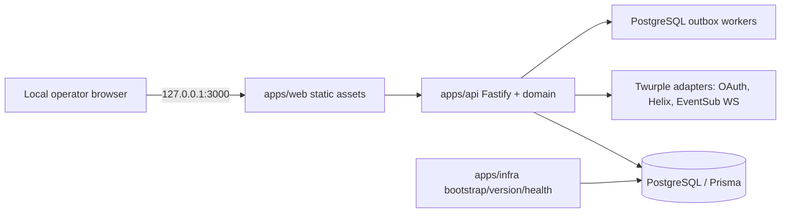

# Runtime topology
[Português brasileiro](../pt-BR/fullstack-architecture/runtime-topology.md)

Root `Dockerfile` and `compose.yaml` are product entrypoints. Compose services: one-shot `bootstrap`; persistent healthy `db`; one-shot `migrate` after DB health; non-root `bot` only after migrations complete. Host publishes only `127.0.0.1:3000:3000`; Fastify binds `0.0.0.0` in its container. Database has no host port. Volumes persist DB and operational secrets.
