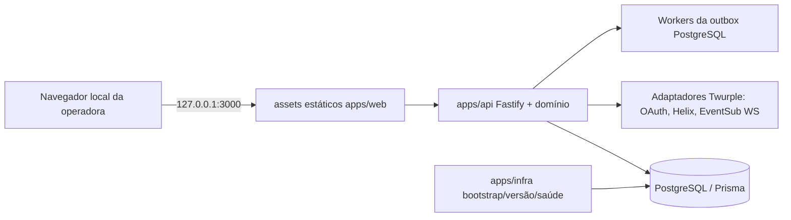

# Arquitetura Fullstack: Bot local de filas da Twitch

[English](../fullstack-architecture.md) · Fonte: [spec FND-0](../stories/FND-0/spec/spec.md), [pesquisa](../stories/FND-0/spec/research.json) e [PRD](../prd.md).

## Restrições da arquitetura

Uma instalação local, uma broadcaster/app Twitch, um processo de bot, PostgreSQL local via Compose, sem backend público/armazenamento remoto/telemetria. Runtime do produto em JavaScript ESM e assets vanilla; `.env.example` continua sendo scaffolding do framework AIOX. Código em `apps/*`.

## Topologia de runtime

`Dockerfile` e `compose.yaml` na raiz são pontos de entrada do produto. Serviços Compose: `bootstrap` de execução única; `db` persistente e saudável; `migrate` de execução única após a saúde do banco; `bot` sem root e iniciado só após migrations concluídas. O host publica somente `127.0.0.1:3000:3000`; Fastify escuta `0.0.0.0` no contêiner. Banco sem porta publicada. Volumes mantêm banco e segredos operacionais.

## Módulos da aplicação

- `apps/web`: painel HTML/CSS/JS vanilla; consome projeções explícitas da API e usa APIs seguras para texto.
- `apps/api`: composição do processo Fastify, segurança local, handlers, serviços de domínio, adaptadores de persistência e Twitch, EventSub e workers duráveis.
- `apps/api/prisma`: schema/configuração Prisma 6, geração do client e migrations PostgreSQL, incluindo restrições SQL não representadas no schema Prisma.
- `apps/infra`: helper de segredo bootstrap, validação/materialização da versão do produto, saúde e utilitários operacionais.
- `tests`: suites Vitest unitárias/contrato e integrações com PostgreSQL isolado real/Compose.

## Dados e consistência

PostgreSQL mantém configuração de filas, chaves globais, entradas, resgates (inclusive rejeitados), outbox, auditoria, conta/configurações, credenciais OAuth e deduplicação de operações. IDs Twitch e UID são strings. Restrições PostgreSQL garantem unicidade de resgates/mensagens, namespace de chaves, integridade fonte/ID, usuário ativo por fila e idempotência financeira/operacional. Alterações da fila são serializadas em transações curtas; alterações globais de conta têm serialização transacional. Nenhuma transação de banco fica aberta durante I/O Twitch.

Para ações terminais, uma transação altera estado, ordem/propriedade de conta, auditoria, fotografia da política e intenção na outbox. O worker chama a Twitch após commit e registra confirmação/retry/conflito/desconhecido. A execução pela rede não é exatamente uma vez. Envio de chat é efeito separado; texto sensível a privacidade é criado no envio com as configurações atuais da fila.

## Fronteira Twitch

Usar o client confidencial e token de usuário da streamer. Client Credentials valida o par de app; Authorization Code usa `state` de uso único associado à sessão. Renovação Twurple é persistida atomicamente. EventSub WebSocket recebe eventos de chat e resgates; Helix gerencia recompensas/status de resgates e envia mensagens. Métodos/campos do SDK fixado são verificados durante implementação. Reconciliação lê páginas remotas, deduplica por ID e nunca infere estado terminal pela ausência em páginas.

## API e segurança local

Rotas do painel exigem sessão local. Validar Host e Origin exatos, bloquear DNS rebinding antes de rotas admin, usar cookies HttpOnly/SameSite e CSRF por sessão, validar schemas/chave de idempotência/revisão nas mutações. Callback OAuth é exceção GET limitada para Origin; Host/sessão/state continuam obrigatórios. Retornar projeções, não entidades Prisma. Sanitizar erros/logs Fastify/SDK/Prisma; nunca retornar ou registrar segredos, tokens, códigos OAuth, senha de banco, connection string ou payload bruto de chat/resgate.

## Operação CLI-first

Ciclo de vida e diagnósticos operacionais estão disponíveis pelos comandos e scripts Docker Compose; operações que alteram domínio continuam nas experiências de painel/chat especificadas. O painel local é superfície de controle exigida pelo produto e não contorna autorização, persistência ou auditoria do domínio.

## Identidade de versão

`package.json` armazena SemVer base, `.release-stage` o estágio e `VERSION` a identidade runtime completa. `apps/infra` valida/materializa prefixo exato de sete caracteres hexadecimais do commit de origem para artefatos; inicialização/verificações comuns não alteram arquivos de versão. Estado da API separa versão do produto, versão do contrato API e revisão do estado.

## Verificação e risco de plataforma

Testes unitários usam portas Twitch falsas e relógio controlável. Garantias de restrição, transações, migrations, leases e recuperação usam PostgreSQL isolado. Aceitação Compose verifica bootstrap, ordem, saúde, persistência após reinício e runtime sem root. Permissões de secrets baseados em arquivo exigem verificação empírica em cada plataforma declarada; nenhuma paridade entre hosts é alegada antes desses testes.
