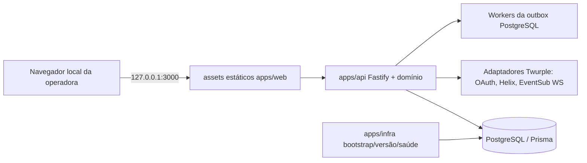

# Topologia de runtime
[English](../../fullstack-architecture/runtime-topology.md)

`Dockerfile` e `compose.yaml` na raiz são pontos de entrada do produto. Serviços Compose: `bootstrap` de execução única; `db` persistente e saudável; `migrate` de execução única após a saúde do banco; `bot` sem root e iniciado só após migrations concluídas. O host publica somente `127.0.0.1:3000:3000`; Fastify escuta `0.0.0.0` no contêiner. Banco sem porta publicada. Volumes mantêm banco e segredos operacionais.
